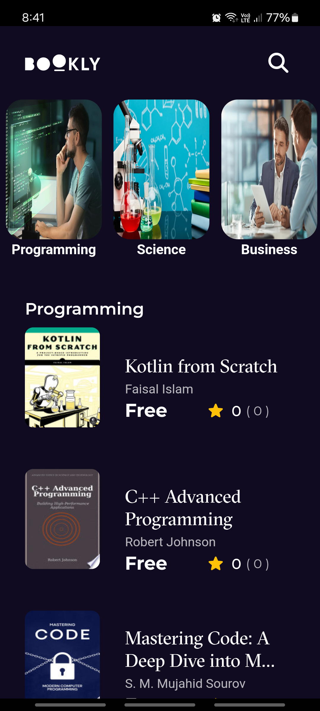
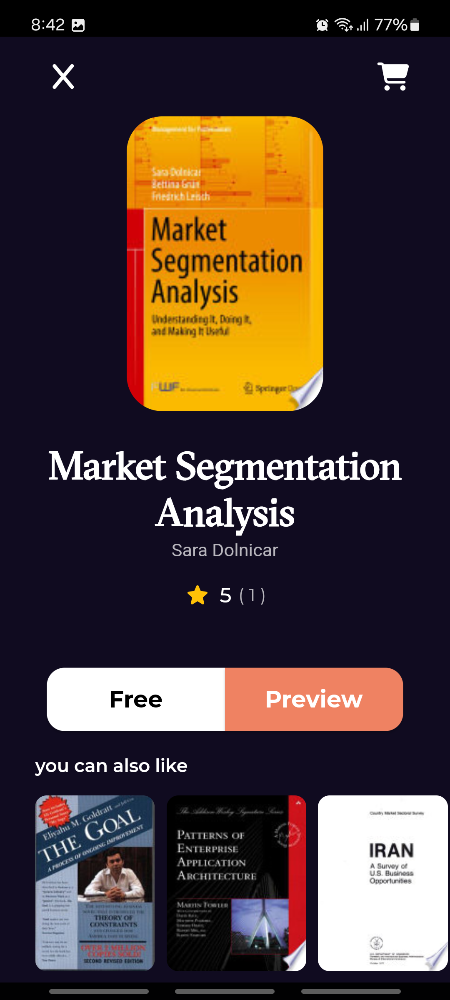

# Book Finder App 📚

A Flutter app that lets users search for books based on titles, authors, or keywords. This app uses the Google Books API to fetch and display book details. Users can explore book information.

## Features
- **Splash Screen:** A welcoming screen with the app's branding.
- **Home Screen:** Displaying book categories and the best-selling books 
- **Book Details Screen:** Detailed information about each book, including title, author, description, similar books, and a link to preview.

## Screenshots
Here's a preview of the app screens:

### Home Screen

### Details Screen

